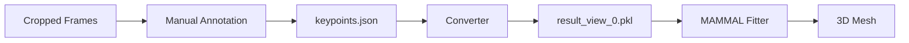

# Keypoint Annotation Quick Start

**빠르게 시작하는 Keypoint 기반 Mesh Fitting**

---

## TL;DR

```bash
# 1. Keypoint 수동 annotation (Gradio UI)
python keypoint_annotator_v2.py data/100-KO-male-56-20200615_cropped

# 2. MAMMAL 포맷으로 변환
python convert_keypoints_to_mammal.py \
  --input keypoints.json \
  --output data/100-KO-male-56-20200615_cropped/keypoints2d_undist/result_view_0.pkl \
  --num-frames 20

# 3. Mesh fitting 실행
python fitter_articulation.py dataset=custom_cropped
```

---

## 주요 개념

### 1. **MAMMAL은 몇 개의 keypoint가 필요한가?**

**답**: **1개부터 22개까지 유연하게 사용 가능!**

- ✅ **1-3개**: 위치만 맞춤 (coarse alignment)
- ✅ **5-7개** (권장): 전체 pose 추정 가능
- ✅ **10개+**: 세밀한 fitting

**핵심**: Missing keypoint는 confidence=0으로 설정 → 자동으로 무시됨

### 2. **Confidence 메커니즘**

```python
# fitter_articulation.py:214
diff = (J2d_projected - target_2d) * confidence

# confidence=0 → diff=0 → loss 기여 안 함!
```

**결과**:
- 있는 keypoint만 사용
- 없는 keypoint는 자동 무시
- 유연한 annotation 가능

### 3. **MAMMAL Fitting 과정**

**3단계 최적화**:

1. **Step 0** (Coarse): 위치/크기만 맞춤 (`rotation`, `translation`, `scale`)
2. **Step 1** (Pose): 관절 각도 최적화 (`thetas`)
3. **Step 2** (Refinement): 마스크로 미세조정 (발 부분 강화)

**Loss 구성**:
```python
total_loss =
  + keypoint_2d_loss * 0.2    # 주요 signal!
  + theta_regularization * 3
  + bone_length * 0.5
  + scale * 0.5
  + mask_loss * 3000          # Step 2에서만
```

---

## 필수 Keypoint

### Core 7 Keypoints (권장)

1. **`nose`**: 코 끝
2. **`neck`**: 목 base
3. **`spine_mid`**: 척추 중간
4. **`hip`**: 골반
5. **`tail_base`**: 꼬리 base
6. **`left_ear`**: 왼쪽 귀
7. **`right_ear`**: 오른쪽 귀

**최소 추천**: `nose`, `spine_mid`, `hip`, `tail_base` (4개)

---

## 데이터 포맷

### Manual Annotation (JSON)

```json
{
  "frame_000000": {
    "nose": {"x": 50.0, "y": 30.0, "visibility": 1.0},
    "neck": {"x": 60.0, "y": 40.0, "visibility": 0.5},
    "spine_mid": {"x": 70.0, "y": 50.0, "visibility": 1.0}
  }
}
```

**Visibility**:
- `1.0`: 명확하게 보임
- `0.5`: 일부 가려짐/불확실
- `0.0`: 안 보임 (사용 안 함)

### MAMMAL Format (PKL)

```python
# NumPy array shape: (num_frames, 22, 3)
# [:, :, 0] = x
# [:, :, 1] = y
# [:, :, 2] = confidence
```

---

## Troubleshooting

### Q: 7개보다 적어도 되나요?

✅ **예!** 1개부터 가능합니다. 단, 최소 3-4개 권장 (spine landmarks).

### Q: Mask 없이 keypoint만으로 가능한가요?

✅ **예!** Step 0-1은 keypoint만 사용. Step 2는 mask 선택사항.

### Q: SAM annotation을 keypoint로 쓸 수 있나요?

⚠️ **비추천**. SAM 클릭은 semantic keypoint가 아님. 수동 annotation 권장.

### Q: 변환 후 확인 방법?

```python
import pickle
with open('result_view_0.pkl', 'rb') as f:
    kpts = pickle.load(f)
print(kpts.shape)  # (20, 22, 3)
print(kpts[0])     # Frame 0의 22개 keypoint
```

---

## 전체 워크플로우



**시간**:
- Annotation: ~30초/frame (7 keypoints)
- Conversion: 즉시
- Fitting: ~10초/frame

---

## 다음 단계

자세한 내용은 [`docs/KEYPOINT_WORKFLOW.md`](docs/KEYPOINT_WORKFLOW.md) 참고.
