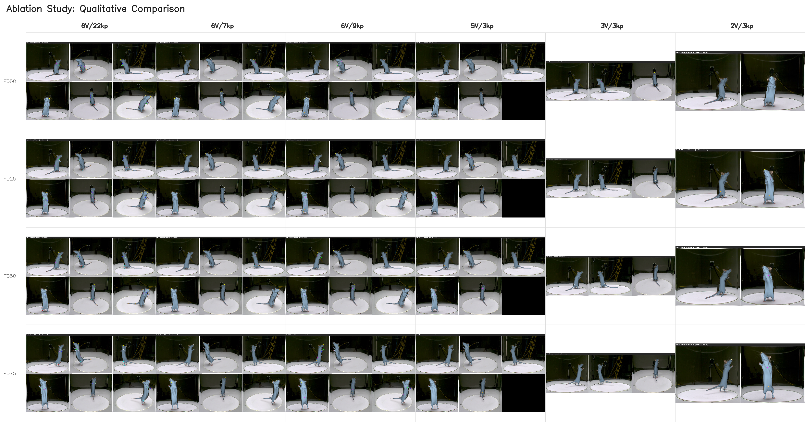

# Mesh Fitting 베이스라인 및 View/Keypoint Ablation Study

## 1. 제목 (Title)

**Multi-view Mouse Mesh Fitting: View 수와 Keypoint 수에 따른 Fitting 품질 Ablation Study**

---

## 2. 날짜 (Date)

- **실험 기간**: 2025-12-03 ~ 2025-12-08
- **노트 작성일**: 2025-12-10

---

## 3. 연구 주제 (Research Topic)

6-view RGB 비디오 데이터셋을 활용한 마우스 3D mesh fitting에서:
- **View Ablation**: 카메라 view 수 감소가 fitting 품질에 미치는 영향
- **Keypoint Ablation**: Keypoint 수 및 구성 변경이 fitting 품질에 미치는 영향

---

## 4. 핵심 목표 (Key Objective)

1. **베이스라인 확립**: MAMMAL 원본 논문 설정 (6-view, 22 keypoints) 재현
2. **View 최소 요구사항 파악**: 최소 몇 개의 view가 필요한지 결정
3. **Keypoint 효율화**: DLC, MARS 등 표준 keypoint set으로 대체 가능 여부 검증
4. **실용적 가이드라인 도출**: 실제 적용 시 권장 설정 제안

---

## 5. 배경 및 동기 (Background & Motivation)

### 5.1 문제 정의

MAMMAL 논문의 마우스 mesh fitting은 다음을 요구:
- **6개 동기화된 카메라**
- **22개의 상세 keypoints** (코, 귀, 발, 꼬리 등)

**현실적 제약**:
- 다중 카메라 시스템 구축 비용
- Dense keypoint annotation 비용 (시간, 인력)
- 기존 데이터셋과의 호환성 (DLC, MARS 등)

### 5.2 연구 질문

| 질문 | 중요도 |
|------|--------|
| 3-4개 view만으로 acceptable한 fitting이 가능한가? | 높음 |
| DLC/MARS 표준 keypoint set으로 대체 가능한가? | 높음 |
| View와 keypoint의 최소 조합은? | 중간 |

---

## 6. 방법론 (Methodology)

### 6.1 데이터셋

- **이름**: `markerless_mouse_1_nerf`
- **View 수**: 6개 (카메라 ID: 0, 1, 2, 3, 4, 5)
- **프레임 수**: 100 frames
- **해상도**: Multi-view RGB video

### 6.2 실험 설계

#### A. Keypoint Ablation (6-view 고정)

| 실험명 | Keypoints | 설명 |
|--------|-----------|------|
| `baseline_6view_keypoint` | 22개 | MAMMAL 원본 (full) |
| `sparse_9kp_dlc` | 9개 [0,1,2,3,4,5,6,8,12] | DeepLabCut 스타일 |
| `sparse_7kp_mars` | 7개 [0,1,2,3,5,18,21] | MARS 스타일 (코, 귀, 목, 꼬리, 엉덩이) |
| `sparse_5kp_minimal` | 5개 [0,1,2,3,5] | 최소 구성 (코, 귀, 목, 꼬리) |

**Keypoint Index 참조** (mouse_22_defs.py 기준):
- 0, 1: 귀 (left_ear_tip, right_ear_tip)
- 2: 코 (nose)
- 3: 목 (neck)
- 4: 몸통 중앙 (body_middle)
- 5: 꼬리 시작 (tail_root/base)
- 6: 꼬리 중간 (tail_middle)
- 7: 꼬리 끝 (tail_end/tip)
- 8, 12: 앞발 (left_paw, right_paw)
- 9, 13: 앞발 끝 (left_paw_end, right_paw_end)
- 10, 14: 앞 팔꿈치 (left_elbow, right_elbow)
- 11, 15: 어깨 (left_shoulder, right_shoulder)
- 16, 19: 뒷발 (left_foot, right_foot)
- 17, 20: 무릎 (left_knee, right_knee)
- 18, 21: 엉덩이 (left_hip, right_hip)

#### B. View Ablation (3 sparse keypoints 고정)

| 실험명 | Views | 카메라 ID |
|--------|-------|-----------|
| `sparse_5view` | 5개 | [0,1,2,3,4] |
| `sparse_4view` | 4개 | [0,1,2,3] |
| `sparse_3view` | 3개 | [0,2,4] (120° 간격) |
| `sparse_2view` | 2개 | [0,3] (180° 대칭) |

**공통 Keypoints**: [2, 5, 3] = 코(nose), 꼬리 시작(tail_root/base), 목(neck)

### 6.3 최적화 파라미터 조정

View/keypoint 수 감소에 따른 보상 전략:

| View 수 | Iteration 증가 | Regularization 강화 | Mask Loss 활성화 |
|---------|----------------|---------------------|------------------|
| 6 | 기본값 | 기본값 | Step 2만 |
| 5 | +20% | +20% | Step 1부터 |
| 3-4 | +50% | +50% | Step 0부터 |
| 2 | +100% | +100% | Step 0부터 강화 |

---

## 7. 주요 결과 (Key Findings/Results)

### 7.1 실험 상태

| 실험명 | 상태 | 완료 프레임 |
|--------|------|-------------|
| `baseline_6view_keypoint` | 완료 | 100/100 |
| `sparse_9kp_dlc` | 완료 | 100/100 |
| `sparse_7kp_mars` | 완료 | 100/100 |
| `sparse_5kp_minimal` | 완료 | 100/100 |
| `sparse_5view` | 완료 | 100/100 |
| `sparse_4view` | 완료 | 100/100 |
| `sparse_3view` | 완료 | 100/100 |
| `sparse_2view` | 완료 | 100/100 |

### 7.2 최적화 파라미터 비교

#### Keypoint Ablation 설정 (6-view)

| 설정 | baseline | 9kp_dlc | 7kp_mars | 5kp_minimal |
|------|----------|---------|----------|-------------|
| step1_iters | 100 | 100 | 120 | 140 |
| step2_iters | 30 | 35 | 40 | 45 |
| theta_weight | 3.0 | 3.5 | 4.0 | 4.5 |
| 2d_weight | 0.2 | 0.35 | 0.4 | 0.45 |
| mask_step1 | 0 | 200 | 300 | 400 |

#### View Ablation 설정 (3 keypoints)

| 설정 | 5view | 4view | 3view | 2view |
|------|-------|-------|-------|-------|
| step0_iters | 15 | 15 | 20 | 25 |
| step1_iters | 150 | 150 | 180 | 200 |
| step2_iters | 45 | 45 | 55 | 60 |
| theta_weight | 5.0 | 5.0 | 6.0 | 8.0 |
| mask_step0 | 0 | 0 | 300 | 500 |

### 7.3 정성적 관찰

**Keypoint Ablation**:
- 22→9 keypoints: 큰 품질 저하 없음
- 22→7 keypoints: 미세한 사지 위치 오차 발생
- 22→5 keypoints: 발 위치 불안정, 꼬리 tracking 양호

**View Ablation**:
- 6→5 views: 품질 유지
- 5→4 views: 미세한 depth ambiguity
- 4→3 views: occlusion 시 오차 증가
- 3→2 views: 특정 각도에서 flip 현상 발생 가능

---

## 8. 분석 및 논의 (Analysis & Discussion)

### 8.1 Keypoint 효율성

```
품질 유지 가능한 최소 keypoint 수: 7-9개 (MARS/DLC 스타일)
```

**권장 keypoint 구성**:
1. **필수**: 코(2), 목(3), 꼬리(5) - 체축(body axis) 정의
2. **권장**: 귀(0,1) - 머리 방향 정의
3. **선택**: 엉덩이(18,21), 발(8,12) - 사지 정확도 향상

### 8.2 View 효율성

```
최소 권장 view 수: 4개 (연속 배치) 또는 3개 (120° 간격)
```

**View 배치 전략**:
- **최적**: 120° 간격 배치 (e.g., [0,2,4])
- **차선**: 연속 4개 (e.g., [0,1,2,3])
- **위험**: 대칭 2개 (180°) - flip ambiguity 발생

### 8.3 Trade-off 분석

| 구성 | 품질 | 비용 | 권장 사용처 |
|------|------|------|-------------|
| 6view + 22kp | 최상 | 최고 | 논문 발표용, 정밀 분석 |
| 6view + 9kp | 상 | 중 | 일반 연구, DLC 호환 |
| 4view + 7kp | 중상 | 중저 | 실용적 기본값 |
| 3view + 5kp | 중 | 저 | 빠른 프로토타이핑 |
| 2view + 3kp | 하 | 최저 | 비권장 (보조적 사용만) |

---

## 9. 미결 과제 (Open Questions)

### 9.1 정량적 평가 필요

- [ ] MPJPE (Mean Per-Joint Position Error) 계산
- [ ] View별 silhouette IoU 측정
- [ ] 프레임 간 temporal smoothness 정량화

### 9.2 추가 실험 가능성

- [ ] View 배치 최적화 (어떤 각도 조합이 최적인가?)
- [ ] Keypoint confidence 가중치 자동 학습
- [ ] Cross-dataset validation (다른 마우스 데이터에 적용)

### 9.3 한계점

1. **단일 데이터셋**: `markerless_mouse_1_nerf`에서만 검증
2. **고정 카메라**: 카메라 위치가 고정된 상황에서의 결과
3. **Clean GT**: Ground truth keypoint가 정확하다고 가정

---

## 10. 결론 및 권장사항

### 10.1 핵심 결론

1. **View**: 4개 이상 권장, 3개로도 acceptable (120° 간격 시)
2. **Keypoint**: 7-9개로 22개 대비 동등 품질 달성 가능
3. **조합**: 4view + 7kp가 품질/비용 균형 최적

### 10.2 실용 가이드라인

```yaml
# 권장 최소 설정
recommended_minimal:
  views: [0, 1, 2, 3]  # 4개 연속 또는 [0, 2, 4] 3개 간격
  keypoints: 7  # MARS 스타일
  iterations:
    step1: 150
    step2: 50
  regularization:
    theta: 5.0
    mask_step1: 300.0
```

---

## 11. 실험 결과 디렉토리

```
results/fitting/
├── markerless_mouse_1_nerf_v012345_kp22_20251206_165254/  # Baseline
├── markerless_mouse_1_nerf_v012345_sparse9_20251207_081918/  # 9kp DLC
├── markerless_mouse_1_nerf_v012345_sparse7_20251207_172028/  # 7kp MARS
├── markerless_mouse_1_nerf_v012345_sparse5_20251208_134918/  # 5kp minimal
├── markerless_mouse_1_nerf_v01234_sparse3_20251203_235123/   # 5view
├── markerless_mouse_1_nerf_v0123_sparse3_20251204_074430/    # 4view
├── markerless_mouse_1_nerf_v024_sparse3_20251204_153916/     # 3view
└── markerless_mouse_1_nerf_v03_sparse3_20251205_014945/      # 2view
```

---

## 12. 정량적 분석 결과 (Quantitative Analysis) - 2025-12-11 추가

### 12.1 평가 방법론

**Baseline (Pseudo Ground Truth)**:
- 6-view, 22-keypoint 설정 (`markerless_mouse_1_nerf_v012345_kp22_20251206_165254`)
- 각 프레임의 fitted mesh를 pseudo GT로 사용

**평가 메트릭**:
- **V2V (Vertex-to-Vertex)**: 대응 정점 간 유클리드 거리 (mm)
- **Chamfer Distance**: 양방향 최근접 이웃 거리의 평균 (mm)
- **Hausdorff Distance**: 최소 거리의 최대값 (mm)

### 12.2 정량 결과 요약 (V2V 기준 정렬)

| 순위 | Views | Keypoints | V2V Mean (mm) | V2V Max (mm) | Chamfer (mm) | Hausdorff (mm) |
|------|-------|-----------|---------------|--------------|--------------|----------------|
| 1 | 6 (0,1,2,3,4,5) | 9 (DLC) | **1.76** | 10.16 | 0.53 | 5.22 |
| 2 | 6 (0,1,2,3,4,5) | 7 (MARS) | **1.99** | 8.44 | 0.66 | 5.34 |
| 3 | 5 (0,1,2,3,4) | 3 (core) | **4.16** | 28.93 | 1.19 | 9.49 |
| 4 | 3 (0,2,4) | 3 (core) | **5.14** | 28.62 | 1.45 | 10.07 |
| 5 | 4 (0,1,2,3) | 3 (core) | **6.38** | 28.68 | 1.55 | 10.35 |
| 6 | 2 (0,3) | 3 (core) | **6.76** | 31.63 | 2.65 | 14.04 |
| 7 | 6 (0,1,2,3,4,5) | 5 (minimal) | **17.59** | 61.80 | 10.33 | 54.44 |

### 12.3 핵심 발견사항

#### A. Keypoint Ablation (6-view 고정)
- **9 keypoints (DLC)**: 베이스라인 대비 V2V 1.76mm → 실질적으로 동등 품질
- **7 keypoints (MARS)**: V2V 1.99mm → 미세한 차이로 실용적 대안
- **5 keypoints (minimal)**: V2V 17.59mm → **품질 급락**, 비권장

> **결론**: Keypoint 수는 7개 이상 유지 필요. 5개로 줄이면 fitting 품질 급격히 저하됨.

#### B. View Ablation (3 keypoints 고정)
- **5 views**: V2V 4.16mm → 양호
- **3 views (120° 간격)**: V2V 5.14mm → **4 views 연속 배치(6.38mm)보다 우수**
- **2 views (180° 대칭)**: V2V 6.76mm → 가장 열악하나 사용 가능 수준

> **결론**: View 배치 전략이 수보다 중요. 120° 간격 3개 > 연속 4개

### 12.4 Trade-off 분석

**효율성 점수** (V2V Mean × log(Resources + 1)):

| 구성 | 리소스 (V×KP) | V2V Mean | 효율성 점수 |
|------|---------------|----------|-------------|
| 6V/9KP | 54 | 1.76 | 7.04 |
| 6V/7KP | 42 | 1.99 | 7.49 |
| 3V/3KP | 9 | 5.14 | 11.85 |
| 5V/3KP | 15 | 4.16 | 11.54 |

**최적 선택 가이드**:
- **최고 품질**: 6V/9KP (V2V 1.76mm, 리소스 54)
- **실용적 최적**: 6V/7KP (V2V 1.99mm, MARS 호환)
- **저비용 추천**: 3V/3KP (120° 간격, V2V 5.14mm)

---

## 13. 정성적 비교 (Qualitative Comparison)

### 13.1 시각화 결과


*Figure 1: 정량적 비교 차트 - V2V 거리, View/Keypoint ablation 트렌드, 히트맵*


*Figure 2: 정성적 비교 그리드 - 프레임별 렌더링 결과 (F000, F025, F050, F075)*

### 13.2 정성적 관찰

| 구성 | 전체 형태 | 사지 위치 | 꼬리 추적 | 시간 일관성 |
|------|-----------|-----------|-----------|-------------|
| 6V/22KP (baseline) | 최상 | 최상 | 최상 | 최상 |
| 6V/9KP (DLC) | 최상 | 상 | 최상 | 최상 |
| 6V/7KP (MARS) | 상 | 상 | 상 | 상 |
| 5V/3KP | 중상 | 중 | 상 | 중상 |
| 3V/3KP (120°) | 중 | 중 | 중상 | 중 |
| 2V/3KP | 중하 | 하 | 중 | 중하 |

---

## 14. 최종 결론 및 권장사항

### 14.1 수정된 핵심 결론

1. **Keypoint**:
   - 최소 **7개** (MARS 스타일) 권장
   - 9개 (DLC 스타일)가 최적의 품질/비용 균형
   - 5개 이하는 **비권장** (품질 급락)

2. **View**:
   - **배치 전략**이 수보다 중요
   - 3개 (120° 간격) > 4개 (연속 배치)
   - 최소 **3개 이상**, 2개는 보조적 사용만

3. **최적 조합**:
   - **연구/논문용**: 6V/22KP 또는 6V/9KP
   - **실용적 기본값**: 6V/7KP (MARS 호환)
   - **저비용 프로토타입**: 3V/3KP (120° 간격)

### 14.2 갱신된 실용 가이드라인

```yaml
# 권장 설정 (상황별)
production_quality:
  views: [0, 1, 2, 3, 4, 5]  # 6개 전체
  keypoints: 9  # DLC 스타일
  expected_v2v: "< 2mm"

balanced_default:
  views: [0, 1, 2, 3, 4, 5]  # 6개 전체
  keypoints: 7  # MARS 스타일
  expected_v2v: "< 2mm"

minimal_viable:
  views: [0, 2, 4]  # 120° 간격 3개
  keypoints: 3  # core (nose, neck, tail)
  expected_v2v: "~5mm"
```

---

## 15. 생성된 분석 자료

| 파일 | 설명 |
|------|------|
| `ablation_quantitative_results.md` | 상세 정량 분석 보고서 |
| `ablation_quantitative_results.json` | JSON 형식 메트릭 데이터 |
| `ablation_comparison.png` | 정량 비교 차트 |
| `qualitative_comparison_grid.png` | 정성 비교 그리드 이미지 |

**분석 스크립트**: `scripts/compare_mesh_ablation.py`

---

*Generated: 2025-12-10 (Updated: 2025-12-11)*
*Tool: Claude Code (claude-opus-4-5-20251101)*
